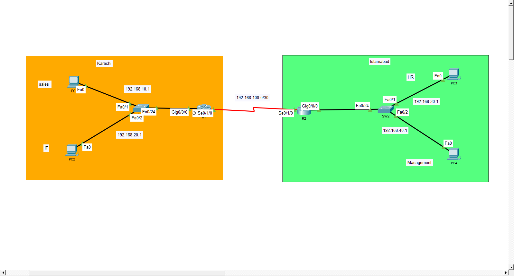

# 🌐 Two-Router Static Routing Network

A Cisco Packet Tracer networking lab demonstrating VLANs, trunking, Router-on-a-Stick, inter-router connectivity, and static routing.

## 🖥️ Topology



## 🎯 Objectives

- Configure VLANs on two switches
- Configure access ports
- Configure trunk links
- Configure Router-on-a-Stick
- Configure an R1-R2 routed link
- Configure static routes
- Test end-to-end connectivity
- Troubleshoot network connectivity

## 🧩 Network Devices

- 2 Routers
- 2 Cisco 2960 Switches
- 4 PCs

## 🔀 VLANs

| Switch | VLAN | Department | Network |
|---|---:|---|---|
| SW1 | 10 | Sales | 192.168.10.0/24 |
| SW1 | 20 | IT | 192.168.20.0/24 |
| SW2 | 30 | HR | 192.168.30.0/24 |
| SW2 | 40 | Management | 192.168.40.0/24 |

## 🌐 Router Addresses

### R1

| Interface | IP Address | Purpose |
|---|---|---|
| G0/0/0.10 | 192.168.10.1/24 | VLAN 10 Gateway |
| G0/0/0.20 | 192.168.20.1/24 | VLAN 20 Gateway |
| S0/1/0 | 192.168.100.1/30 | R1-R2 Link |

### R2

| Interface | IP Address | Purpose |
|---|---|---|
| G0/0/0.30 | 192.168.30.1/24 | VLAN 30 Gateway |
| G0/0/0.40 | 192.168.40.1/24 | VLAN 40 Gateway |
| S0/1/0 | 192.168.100.2/30 | R1-R2 Link |

## 💻 PC Addressing

| PC | VLAN | IP Address | Gateway |
|---|---:|---|---|
| PC0 | 10 | 192.168.10.10 | 192.168.10.1 |
| PC1 | 20 | 192.168.20.10 | 192.168.20.1 |
| PC2 | 30 | 192.168.30.10 | 192.168.30.1 |
| PC3 | 40 | 192.168.40.10 | 192.168.40.1 |

## 🛠️ Technologies Practiced

- VLAN
- Access Ports
- 802.1Q Trunking
- Router-on-a-Stick
- IPv4 Addressing
- /30 Point-to-Point Network
- Static Routing
- Network Troubleshooting
- Cisco IOS CLI

## 🔍 Verification

Commands used:

```text
show vlan brief
show interfaces trunk
show ip interface brief
show ip route
ping
